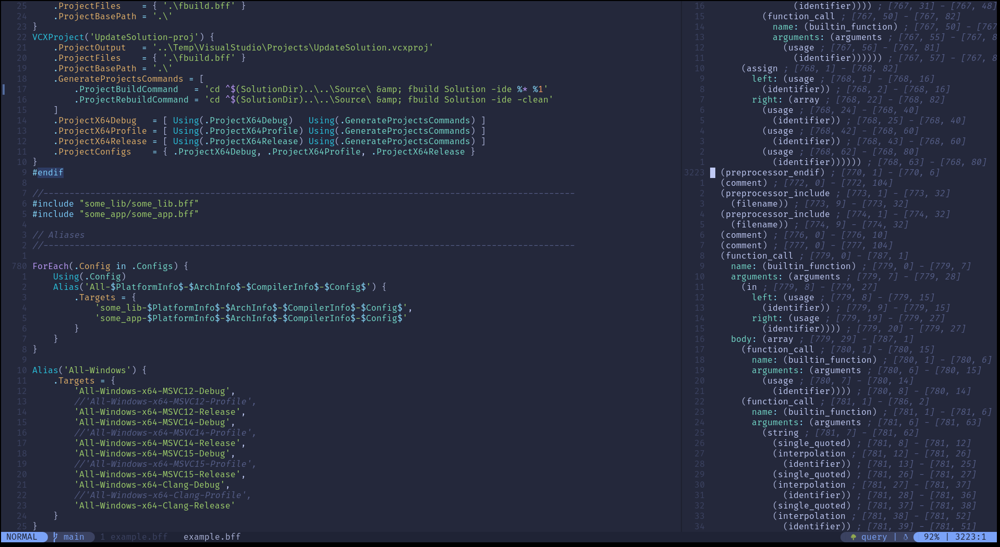

# tree-sitter-fastbuild

[FASTBuild](https://github.com/fastbuild/fastbuild) grammar for [tree-sitter](https://github.com/tree-sitter/tree-sitter)

## Usage
It's not published on grammar lists yet

### NeoVim
```lua
local parsers = require 'nvim-treesitter.parsers'.get_parser_configs()
vim.filetype.add {
	extension = {
		bff = 'fastbuild',
	},
}
parsers.fastbuild = {
	install_info = {
		url = '/path/or/url/to/tree-sitter-fastbuild/',
		files = {
			'src/parser.c',
			'src/scanner.c',
		},
		generate_requires_npm = false,
		requires_generate_from_grammar = true,
	},
	filetype = 'fastbuild',
}
vim.treesitter.language.register('fastbuild', 'fastbuild')
```

## Links
- [Syntax](https://fastbuild.org/docs/syntaxguide.html)

## Example

